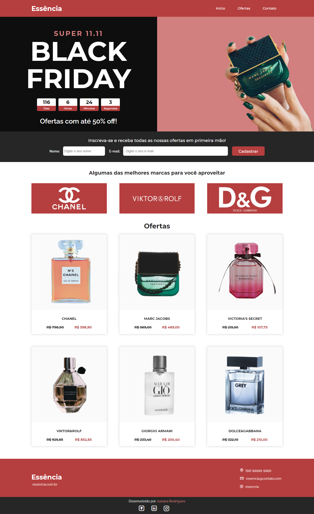

##### Projeto desenvolvido durante o Hiring Coders #2 | VTEX & Gama Academy

---

#  Mimo's Pet

###### Página de um e-commerce para cadastro de clientes e registro de carrinho de compras, com armazenamento no Local Storage.

#### Disponível em: [Mimo's Pet]()

---

#### Design criado utilizando:

#### Desenvolvido utilizando:

#### Outros recursos utilizados:

- [ViaCEP API](https://viacep.com.br/) para preenchimento automático de endereços a partir do CEP informado.
- Arquivo JSON inspirado em resultados da [Fake Store API](https://fakestoreapi.com/) com dados dos produtos a serem exibidos (products.json).

---

#### Captura de tela (desktop):

