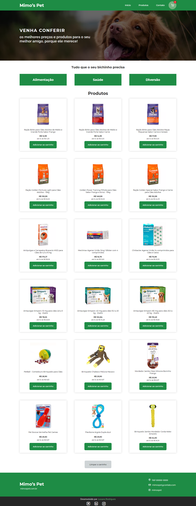

##### Projeto desenvolvido durante o Hiring Coders #2 | VTEX & Gama Academy

---

#  Mimo's Pet

###### Página de um e-commerce para cadastro de clientes e registro de carrinho de compras, com armazenamento no Local Storage.

#### Disponível em: [Mimo's Pet](https://mimospet.netlify.app/)

---

#### Design criado utilizando:

#### Desenvolvido utilizando:

#### Outros recursos utilizados:

- [ViaCEP API](https://viacep.com.br/) para preenchimento automático de endereços a partir do CEP informado.
- Arquivo JSON inspirado em resultados da [Fake Store API](https://fakestoreapi.com/) com dados dos produtos a serem exibidos (products.json).

#### Funcionalidades: 

- Cadastro de cliente, com armazenamento de dados no Local Storage, com a seguinte estrutura:
~~~
Key: client 
Value:
{
  name: 'xxxx xxxx xxxx',
  birthDate: 'xx/xx/xxxx',
  contact: 'xxxxxxxxxxx',
  email: 'xxxxx@xxxxx.xxx',
  address: {
    cep: 'xxxxxxxx',
    state: 'xx',
    publicArea: 'xxxxx xxxxx',
    district: 'xxxxxxxx',
    city: 'xxxxxxx',
    number: 'xxx'
  }
}
~~~

- Adição de produtos ao carrinho de compras, com armazenamento de dados no Local Storage, com a seguinte estrutura:
~~~
Key: products
Value:
[
  {
    id: 'xx',
    title: 'xxxxx xxxxxxxx xxxxxxxxx xxxxxxxxxx',
    price: xx.xx
  },
  {
    id: 'xx',
    title: 'xxxxx xxxxxxxx xxxxxxxxx xxxxxxxxxx',
    price: xx.xx
  }
]
~~~

- Limpeza do carrinho de compras, que consiste na exclusão da Key/Value de produtos
- Preenchimento automático dos campos de endereço do cliente, mediante o informe de um número de CPF válido

---

#### Captura de tela (desktop):

